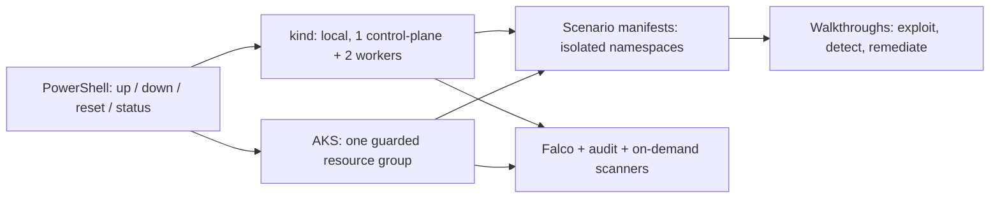

# Kubernetes Security Lab

A disposable, intentionally vulnerable Kubernetes lab for learning attack paths and defensive controls on kind or AKS.

> **AUTHORIZED, SELF-OWNED RESEARCH ONLY.** Use only on clusters and subscriptions you own and control. Never connect these workloads to corporate, shared, or production environments.
>
> **Keep this repo PRIVATE — intentionally vulnerable configs + working exploit steps. Do not publish publicly without sanitizing.** Exposing a vulnerable AKS cluster can put your personal subscription, identity, and employer at risk.

## Architecture



The scenarios are backend-agnostic except for documented AKS-only identity paths and a few node-runtime differences. Services are `ClusterIP` only; use `kubectl port-forward` from your workstation instead of exposing a public service.

## Prerequisites

Windows 11 PowerShell:

```powershell
winget install -e --id Docker.DockerDesktop
winget install -e --id Kubernetes.kind
winget install -e --id Kubernetes.kubectl
winget install -e --id Helm.Helm
winget install -e --id Microsoft.AzureCLI  # AKS only
```

For the secret scan hook, install Python and `pre-commit` (for example `py -m pip install --user pre-commit`); the pinned Gitleaks hook installs its own tool environment. Install Docker Desktop first and keep it running for kind. **Leave Docker Desktop Kubernetes OFF.** In Docker Desktop, open **Settings → Resources → Advanced** and allocate at least **4 CPUs, 8 GB RAM, and a few GB of free disk**. The kind preflight warns when configured resources appear low. For a constrained machine, set `KIND_NODES=single` in `.env`.

If PowerShell blocks the scripts (`running scripts is disabled on this system`), either launch them as `powershell -ExecutionPolicy Bypass -File .\up.ps1`, or allow the current session once with `Set-ExecutionPolicy -Scope Process -ExecutionPolicy Bypass`.

## Quickstart

Local kind needs **no configuration** — `.env` is optional and only required for AKS.

```powershell
# Local disposable cluster (no .env needed):
./up.ps1 -Backend kind
./status.ps1 -Backend kind
kubectl -n webapp port-forward svc/vuln-web 8080:80
# Follow a scenario README, then:
./down.ps1 -Backend kind
```

AKS is opt-in and costs money. First copy and edit the config:

```powershell
Copy-Item .env.example .env
# Edit .env: set AKS_SUBSCRIPTION_ID / AKS_TENANT to your personal Visual Studio
# subscription, and ALLOWED_IP to your public IP with /32.
```

From an authenticated Azure CLI session, after verifying `.env` targets your personal subscription and setting `ALLOWED_IP`:

```powershell
./up.ps1 -Backend aks -AutoDestroyHours 3
./status.ps1 -Backend aks
# Follow scenarios/09-aks-imds-managed-identity/README.md only on this lab.
./down.ps1 -Backend aks
az group exists --name rg-k8s-sec-lab  # must print false after down
```

The AKS script checks the active subscription before resource operations and refuses an empty/broad API allow-list. **Never leave the vulnerable cluster running.** The local auto-destroy watchdog is best-effort: it requires the machine/session running the timer to remain alive and authenticated. Do not treat it as a cloud-side expiry guarantee; use `down` yourself and verify the resource group is gone.

`reset.ps1` removes and reapplies scenario manifests without recreating the cluster. `-Scenarios` takes exact scenario folder names; invalid names fail instead of silently doing nothing.

## Scenario index

| # | Scenario | Vulnerability class | Difficulty | kind / AKS | MITRE ATT&CK |
|---|---|---|:---:|---|---|
| 01 | RBAC privilege escalation | Over-permissive ClusterRoleBinding | Easy | Both | T1078 |
| 02 | Privileged container escape | Container/node isolation | Easy–medium | Both; host is a node container on kind | T1611 |
| 03 | Runtime socket mount | Container-runtime control | Medium | Runtime path differs by node | T1610, T1611 |
| 04 | Sensitive hostPath | Host filesystem exposure | Medium | Both; data is node-local | T1611, T1552 |
| 05 | Secrets exposure | Credential storage and RBAC | Easy | Both | T1552.001 |
| 06 | Missing NetworkPolicy | Flat network / lateral movement | Medium | kind requires a policy-capable CNI for remediation tests | T1046 |
| 07 | Anonymous API access | Anonymous authorization | Medium–hard | Both; kubelet half is a documented comparison | T1610 |
| 08 | SSRF and command injection | Application initial access | Medium–hard | Both; IMDS path only on AKS | T1190, T1059 |
| 09 | IMDS / managed identity | Cloud identity exposure | Hard | AKS only | T1552.005 |

Each scenario folder contains a manifest and a README with impact, deployment, exploit, detection, remediation, and difficulty notes. Scenario manifests are independently deployable with `kubectl apply -f scenarios/<folder>/manifest.yaml`.

## Assessment tools

`up.ps1` installs the pinned Falco runtime detector; it does not run every scanner automatically. Safe, lab-scoped examples and cleanup instructions are in [`tooling/README.md`](tooling/README.md). Scanner commands should target the local image/workload or the explicit lab namespace, never an unrelated cluster.

## AKS cost and teardown

AKS pricing varies by region and date. The create script prints a planning estimate before creating anything; it is not a bill quote and excludes ancillary charges. The default is one Standard_B4ms node, a 30-GiB ephemeral OS disk, no autoscaler, and the free AKS control-plane tier. Standard_B2s has only 8 GiB of local temporary storage, so it cannot support the required Ubuntu ephemeral OS disk; the backend deliberately uses B4ms, which has 32 GiB of temporary storage. The script preflights the selected SKU and refuses to fall back to a managed disk.

| Example node size | Approximate compute cost |
|---|---|
| Standard_B4ms (default) | $0.166/hour; about $3.98/day or $121.18/month (East US Linux list-rate estimate, checked 2026-09-30) |
| Standard_B2s | Not compatible with the required 30-GiB ephemeral OS disk |

**Golden rule: always run `./down.ps1 -Backend aks` at the end of every session.** Teardown deletes the dedicated lab resource group and verifies it is absent. The scripts must refuse to delete a pre-existing group unless it is positively identified as owned by this lab.

## Learning path

1. **Week 1 — identity basics (local):** scenarios 01, 05, and 07. Inspect service accounts, RBAC bindings, secrets, and audit events.
2. **Week 2 — workload isolation (local):** scenarios 02, 03, and 04. Compare privileged pods, runtime sockets, and hostPath boundaries on disposable kind nodes.
3. **Week 3 — network and application paths (local):** scenarios 06 and 08. Demonstrate east-west reachability, then test the web app through `kubectl port-forward`.
4. **Week 4 — cloud identity (AKS only):** scenario 09 and the AKS-specific parts of 08. Use only your personal subscription, IP-restricted API access, and a short session; verify `down` before ending.

More detail: [`docs/learning-path.md`](docs/learning-path.md), [`docs/architecture.md`](docs/architecture.md), and [`docs/how-to-add-a-scenario.md`](docs/how-to-add-a-scenario.md).

## Source control safety

`.env`, kubeconfigs, Azure credentials, certificates, and generated state are ignored. A Gitleaks pre-commit hook is configured in `.pre-commit-config.yaml`; enable it before the first commit:

```powershell
pre-commit install
pre-commit run --all-files
```

Review the staged changes and scan results yourself before publishing. When ready, create an **empty private** GitHub repository and run:

```powershell
git init
git add .
git status
git commit -m "Initial Kubernetes security lab"
git remote add origin git@github.com:<you>/k8s-sec-lab.git
git branch -M main
git push -u origin main
```

Never run those publish commands until you have reviewed the files and confirmed `.env` is not staged.

## License

MIT with an additional intentionally-vulnerable-software notice; see [`LICENSE`](LICENSE).
